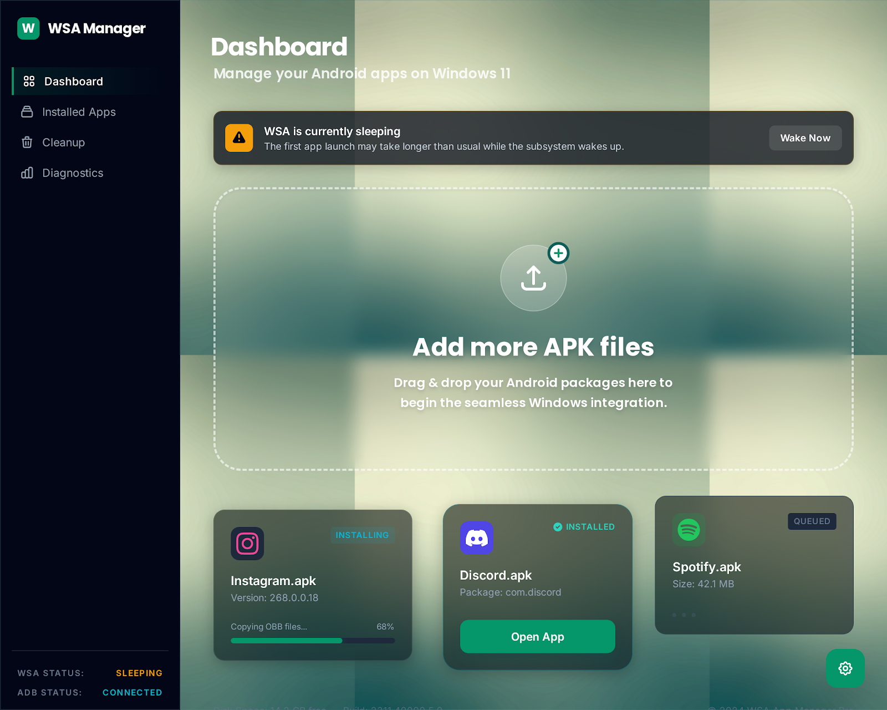

# WSA Manager

Windows utility for installing, removing, and cleaning up Android apps in Windows Subsystem for Android.



## Install

### End users

1. Open the [Releases](https://github.com/chrisjcthomas/wsa-manager/releases) page.
2. Download the latest `WSA.Manager.Setup.<version>.exe`.
3. Run the installer.
4. Launch `WSA Manager` from the Start menu.

This is currently an unsigned beta app. Windows SmartScreen may show a warning the first time you run the installer. If that happens, choose `More info` and then `Run anyway`.

### Portable test build

Each GitHub release also includes a portable package named `WSA.Manager.portable.<tag>.zip`.
For example: `WSA.Manager.portable.v0.1.0.zip`.

Use that build when you want to smoke-test the app without installing it into `AppData\Local\Programs`.

## Requirements

- Windows 11
- Windows Subsystem for Android installed
- `adb.exe` available either from Android platform-tools or a manually selected path

## First run

On first launch, WSA Manager opens the setup wizard automatically when readiness is incomplete.

Typical first-run flow:

1. Confirm WSA is installed.
2. Point the app at `adb.exe` if auto-detection does not find it.
3. Wake WSA if the subsystem is sleeping.
4. Run the setup check until the app reports ready.

Cleanup and diagnostics stay available even when setup is incomplete.

## Development

```bash
npm ci
npm run dev
```

### Core commands

```bash
npm run validate
npm run test:ui
npm run smoke:packaged
npm run test:visual
npm run release:build
```

### Canonical app targets

- Local dev: `npm run dev`
- Packaged smoke target: `release/win-unpacked/WSA Manager.exe`
- Installer acceptance target: `release/WSA.Manager.Setup.<version>.exe`

Do not validate UI work against the installed `Program Files` copy during development, and never hot-swap `app.asar`.

## UI workflow

- Use `docs/code.html` and `docs/screen.png` as the approved visual reference.
- Run packaged smoke checks instead of relying on stale local installs.
- Review screenshot baseline changes intentionally in PRs.

## Codex Review

Codex review in GitHub is set up in two layers:

1. In Codex settings, turn on `Code review` for `chrisjcthomas/wsa-manager`.
2. In a pull request comment, write `@codex review`.

Optional:

- Turn on `Automatic reviews` in Codex settings if you want every PR reviewed without a comment.
- Add one-off focus in the comment when needed, for example `@codex review for packaging regressions` or `@codex review for security regressions`.

This repository uses [AGENTS.md](AGENTS.md) to tell Codex what to prioritize during review.

## Releases

Tagged builds publish GitHub releases automatically.

Release tags use the format:

```text
v0.1.0
```

Each release publishes:

- `WSA.Manager.Setup.<version>.exe`
- `WSA.Manager.Setup.<version>.exe.blockmap`
- `WSA.Manager.portable.<tag>.zip`
- `build-manifest.json`

## Repository workflow

- Work from short-lived branches named `codex/<task>`.
- Open a PR for every non-trivial change.
- Run `npm run validate` before every PR.
- For UI and packaging work, also run `npm run smoke:packaged` and `npm run test:visual`.
- Request `@codex review` on PRs unless automatic reviews are enabled in Codex settings.
